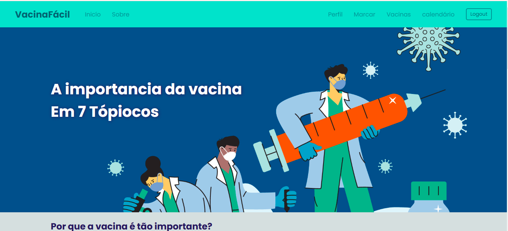

# VacinaFácil

## Sobre o VacinaFácil
Esse projeto foi desenvolvido com o intuito de concientizar as pessoas sobre a importancia de se vacinar, tendo funcionalidade de marcar datas de vacinas e lembrar o usuário quando ele deve tomar-lá com um lembrete enviado por email

### Ferramentas
 - Django
 - Python
 - Html
 - Css
 - Java Script
 - MySQL

 ### Por que foi feito?
 comecei a contruí-lo por conta de uma atividade de enxtenção da faculdade Cruzeiro do Sul, sobre as ODS e ajudar nossa comunidade de alguma maneira

 ## Acesse no seu navegador
 [Acessar site](https://comercial.pythonanywhere.com/)
